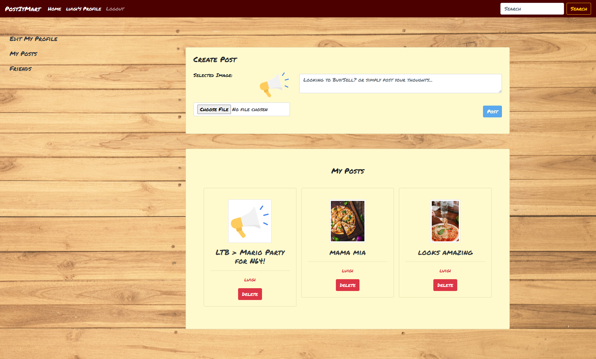

# PostItMart

## Description
A Social Media Application where Users can create/view/like/comment on posts as well as add Friends with other users. Would also like to implement marketplace section where users can also post Products that they want to sell which would be a different type of post. Users would also be able to search for posts or click categories/tags button to see all posts with those categories/tags.

## Table of Contents
- [Deployment](#deployment)
- [Installation](#installation)
- [Usage](#usage)
- [Demo](#demo)
- [Technology](#technology)
- [Credits](#credits)
- [Tests](#tests)
- [Future Development](#future-development)
- [License](#license)

## Deployment
Note - Application still in development
Heroku URL - 

## Installation
- To install necessary dependencies, run the following commands:
npm i OR npm install

- Note that the herokuapp deployment would have the dependencies pre-installed

## Usage
- Visit the deployed application to use.
- Users are directed to the Home page of the application where users can see all the posts made. User then can then login/signup. Signed up users are able to access the sidebar, where they can update their profile, create posts or search and add friends. They can click on the post image to view the post by itself or they can click on the author to view their profile page.

- Backend (Run application locally)
  - To run the application in local, type 'npm install' in the terminal to install all dependencies.
  - After you can run 'npm build' then 'npm run develop' to start development server or 'npm start' to start application

## Demo

## Technology
- MERN Stack (MongoDb,Express.js,React,Node.js)
- Javascript
- CSS
- Project management (Kaban board)
- npm packages/dependencies in server side includes: 
  - apollo-server-express
  - bcrypt
  - body-parser
  - cloudinary
  - dontenv
  - cors
  - express
  - graphql
  - graphql-scalars
  - jsonwebtoken
  - mongoose
- npm packages/dependencies in client side includes:
  - @apollo/client
  - axios
  - bootstrap
  - graphql
  - jwt-decode
  - react
  - react-bootstrap
  - react-dom
  - react-image-file-resizer
  - react-router-dom

## Tests
- No Tests available
- Mutations/Queries tested via apollo sandbox

## Future development
- Marketplace section, where users can post products as well, with description.
- Friends functionality
- Categories/Tag buttons, linking posts/products to categories/tags
- Commenting/Liking posts and have a count

## License
- This project is licensed under MIT license.

